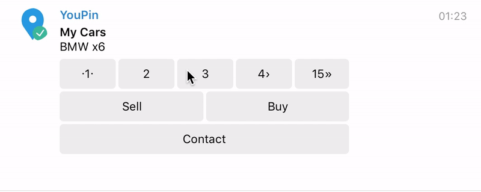

# YouTube extension-telegram-node-bot <br> [](https://www.youtube.com/watch?v=gY9XFo-ob10)

# Extension for Telegram Node Bot
base on <a href="https://github.com/Naltox/telegram-node-bot">telegram-node-bot</a>
# Feature
+ Powerful Form
<br>Button: back, cancel, confirm
<br>Select multiple script for form
<br>Confirm (yes/no) for form
<br>Example: you ask user, would you like write comment? if user choose yes - add comment form else skip
+ New InlineMenu
<br>Single InlineMenu
<br>Many InlineMenu

## Installation

To install the stable version:

```bash
npm install --save extension-telegram-node-bot
```

This assumes you are using [npm](https://www.npmjs.com/) as your package manager.
If you don’t, you can access these files on [unpkg](https://unpkg.com/extension-telegram-node-bot/), download them, or point your package manager to them.

## Get started

```js
const BotExtension = require('extension-telegram-node-bot')
```
Request telegram-node-bot in global variable
```js
global.Telegram = require('telegram-node-bot')
```
Add extension
```js
tg.addScopeExtension(BotExtension.runCustomForm)
tg.addScopeExtension(BotExtension.runCustomInlineMenu)
```


## runCustomForm


Form Config
```js
const config = {
    title: 'Order Pizza', // Title Form
    confirm: {
        text: 'confirm', // button
            message: (result) => {
            return `You name is ${result.name}`
                +`\nPizza is ${result.pizza}`
                +`\nSize is ${result.size}`
                +`\nLocation \u2714`
                +`\nComment${result.addcomment ? `: ${result.comment}` : ' \u2717'}`
        },
        resize_keyboard: true
    },
    back: {
        text: 'Back' // button
    },
    cancel: {
        text: 'Cancel', // button
            message: 'You canceled order pizza',
            callback: ($) => {
            console.log('cancel')
        }
    }
}
```
Form base item
```js
name: {
    text: 'You name', // Question
        question: true, // If you need symbol "?" set true
        error: 'Sorry, you name is incorrect',
        keyboard: [
        [$.message.from.firstName]
    ],
        validator: (message, callback) => {
        if(message.text)
            return callback(true, message.text)
        else callback(false)
    },
        keyboardonly: false // If you want only keybord value, set true
}
```
Form select item
```js
pizza: {
    text: 'Type Pizza',
        question: true,
        error: 'Please select type pizza',
        keyboard: [
        ['Chicken BBQ', 'Chicken Club'],
        ['The Meats','Supreme']
    ],
        keyboardonly: true,
        select: true,
        selectCallback: {
        object: (button) => {
            var object
            if(button == 'Chicken BBQ')
                object = 'pizza1'
            if(button == 'Chicken Club')
                object = 'pizza2'
            if(button == 'The Meats')
                object = 'pizza3'
            if(button == 'Supreme')
                object = 'pizza4'
            return object
        },
            pizza1: {
            size: {
                text: 'Size Chicken BBQ',
                    question: true,
                    error: 'Please select Size Chicken BBQ',
                    keyboard: [
                    ['small', 'medium'],
                    ['large']
                ],
                    keyboardonly: true
            }
        },
        pizza2: {
            size: {
                text: 'Size Chicken Club',
                    question: true,
                    error: 'Please select Size Chicken Club',
                    keyboard: [
                    ['small', 'medium'],
                    ['large']
                ],
                    keyboardonly: true
            }
        },
        pizza3: {
            size: {
                text: 'Size The Meats',
                    question: true,
                    error: 'Please select Size The Meats',
                    keyboard: [
                    ['small', 'medium'],
                    ['large']
                ],
                    keyboardonly: true
            }
        },
        pizza4: {
            size: {
                text: 'Size Supreme',
                    question: true,
                    error: 'Please select Size Supreme',
                    keyboard: [
                    ['small', 'medium'],
                    ['large']
                ],
                    keyboardonly: true
            }
        }


    }
}
```
Form confirm item
```js
addcomment: {
    text: 'You want write comment',
        question: true,
        error: 'Please select yes or no',
        keyboard: [
        ['Yes', 'No']
    ],
        keyboardonly: true,
        confirm: true,
        confirmCallback: {
        status: (button) => {
            if (button === "Yes")
                return true
            else
                return false
        },
            ok: {
            comment: {
                text: 'Write comment',
                    question: false,
                    error: 'Please try again, you can send only text',
                    validator: (message, callback) => {
                    if (message.text) {
                        callback(true, message.text)
                        return
                    }
                    callback(false)
                }
            }
        }
    }
}
```
Full code
```js
$.runCustomForm({
    config: {
        title: 'Order Pizza', // Title Form
        confirm: {
            text: 'confirm',
            message: (result) => {
                return `You name is ${result.name}`
                    +`\nPizza is ${result.pizza}`
                    +`\nSize is ${result.size}`
                    +`\nLocation \u2714`
                    +`\nComment${result.addcomment ? `: ${result.comment}` : ' \u2717'}`
            },
            resize_keyboard: true
        },
        back: {
            text: 'Back'
        },
        cancel: {
            text: 'Cancel',
            message: 'You canceled order pizza',
            callback: ($) => {
                console.log('cancel')
            }
        }
    },
    form: { // Body form
        name: {
            text: 'You name', // Question
            question: true, // If you need symbol "?" set true
            error: 'Sorry, you name is incorrect',
            keyboard: [
                [$.message.from.firstName]
            ],
            validator: (message, callback) => {
                if(message.text)
                    return callback(true, message.text)
                else callback(false)
            },
            keyboardonly: false, // If you want only keybord value, set true
            resize_keyboard: true
        },
        pizza: {
            text: 'Type Pizza',
            question: true,
            error: 'Please select type pizza',
            keyboard: [
                ['Chicken BBQ', 'Chicken Club'],
                ['The Meats','Supreme']
            ],
            keyboardonly: true,
            select: true,
            selectCallback: {
                object: (button) => {
                    var object
                    if(button == 'Chicken BBQ')
                        object = 'pizza1'
                    if(button == 'Chicken Club')
                        object = 'pizza2'
                    if(button == 'The Meats')
                        object = 'pizza3'
                    if(button == 'Supreme')
                        object = 'pizza4'
                    return object
                },
                pizza1: {
                    size: {
                        text: 'Size Chicken BBQ',
                        question: true,
                        error: 'Please select Size Chicken BBQ',
                        keyboard: [
                            ['small', 'medium'],
                            ['large']
                        ],
                        keyboardonly: true
                    }
                },
                pizza2: {
                    size: {
                        text: 'Size Chicken Club',
                        question: true,
                        error: 'Please select Size Chicken Club',
                        keyboard: [
                            ['small', 'medium'],
                            ['large']
                        ],
                        keyboardonly: true
                    }
                },
                pizza3: {
                    size: {
                        text: 'Size The Meats',
                        question: true,
                        error: 'Please select Size The Meats',
                        keyboard: [
                            ['small', 'medium'],
                            ['large']
                        ],
                        keyboardonly: true
                    }
                },
                pizza4: {
                    size: {
                        text: 'Size Supreme',
                        question: true,
                        error: 'Please select Size Supreme',
                        keyboard: [
                            ['small', 'medium'],
                            ['large']
                        ],
                        keyboardonly: true
                    }
                }


            }
        },
        location: {
            text: 'Location for Delivery',
            question: true,
            error: 'You send incorrect location',
            validator: (message, callback) => {
                if(message.location) {
                    callback(true, message.location)
                    return
                }
                callback(false)
            }
        },
        addcomment: {
            text: 'You want write comment',
            question: true,
            error: 'Please select yes or no',
            keyboard: [
                ['Yes', 'No']
            ],
            keyboardonly: true,
            confirm: true,
            confirmCallback: {
                status: (button) => {
                    if (button === "Yes")
                        return true
                    else
                        return false
                },
                ok: {
                    comment: {
                        text: 'Write comment',
                        question: false,
                        error: 'Please try again, you can send only text',
                        validator: (message, callback) => {
                            if (message.text) {
                                callback(true, message.text)
                                return
                            }
                            callback(false)
                        }
                    }
                }
            }
        }
    }
}, (result) => {
    $.sendMessage(`${result.name}! you send form`)
})
```

## runCustomInlineMenu
**Single Menu**
```js
$.runCustomInlineMenu({
    title: 'My Cars',
    items: {
        message: 'BMW x6',
        menu: [
            [
                {
                    text: 'Sell',
                    callback: (callbackQuery, message) => {
                        console.log('Sell')
                    }
                },
                {
                    text: 'Buy',
                    callback: (callbackQuery, message) => {
                        console.log('Buy')
                    }
                }
            ],
            [
                {
                    text: 'Contact',
                    callback: (callbackQuery, message) => {
                        console.log('Contact')
                    }
                }
            ]
        ]
    }
})
```
**Many menu**

```js
$.runCustomInlineMenu({
    title: 'My Cars',
    items: [{
        message: 'BMW x6',
        menu: [
            [
                {
                    text: 'Sell',
                    callback: (callbackQuery, message) => {
                        console.log('Sell')
                    }
                },
                {
                    text: 'Buy',
                    callback: (callbackQuery, message) => {
                        console.log('Buy')
                    }
                }
            ],
            [
                {
                    text: 'Contact',
                    callback: (callbackQuery, message) => {
                        console.log('Contact')
                    }
                }
            ]
        ]
    },
        {
            message: 'Mazda 6',
            menu: [
                [
                    {
                        text: 'Sell',
                        callback: (callbackQuery, message) => {
                            console.log('Sell')
                        }
                    },
                    {
                        text: 'Buy',
                        callback: (callbackQuery, message) => {
                            console.log('Buy')
                        }
                    }
                ],
                [
                    {
                        text: 'Contact',
                        callback: (callbackQuery, message) => {
                            console.log('Contact')
                        }
                    }
                ]
            ]
        },
        {
            message: 'Audi a6',
            menu: [
                [
                    {
                        text: 'Sell',
                        callback: (callbackQuery, message) => {
                            console.log('Sell')
                        }
                    },
                    {
                        text: 'Buy',
                        callback: (callbackQuery, message) => {
                            console.log('Buy')
                        }
                    }
                ],
                [
                    {
                        text: 'Contact',
                        callback: (callbackQuery, message) => {
                            console.log('Contact')
                        }
                    }
                ]
            ]
        }
    ]
})
```
### Fonov Sergei 2016
