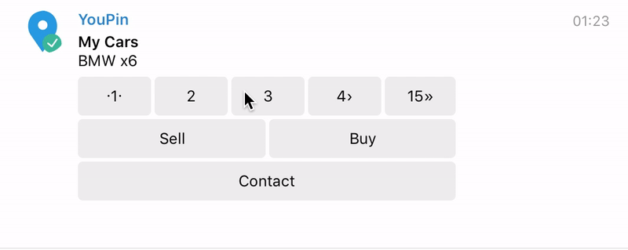

# extension-telegram-node-bot
base on <a href="https://github.com/Naltox/telegram-node-bot">telegram-node-bot</a>
# What we have?
* Powerful Form (button: back, cancel, confirm, event on cancel, message on finish and confirm form)
* New InlineMenu with cancel button [Work]
* New InlineMenyMenu is base on InlineMenu [Work]

## Installation

To install the stable version:

```bash
npm install --save extension-telegram-node-bot
```

This assumes you are using [npm](https://www.npmjs.com/) as your package manager.
If you don’t, you can access these files on [unpkg](https://unpkg.com/extension-telegram-node-bot/), download them, or point your package manager to them.

## Get started

```js
const BotExtension = require('extension-telegram-node-bot')
```
Request telegram-node-bot in global variable
```js
global.Telegram = require('telegram-node-bot')
```
Add extension
```js
tg.addScopeExtension(BotExtension.runCustomForm)
```


## runCustomForm

```js
$.runCustomForm($, {
    config: {
        title: 'Registration new user', // Title Form
        button: { // Special button
            confirm: 'confirm', 
            back: 'Back',
            cancel: 'Cancel'
        },
        message: { // Message on events
            confirm: (result) => {
                return `You name is ${result.name}\nYou age: ${result.age}\nLocation is set`;
            },
            finish: (result) => {
                return `Congratulations, ${result.name}!`;
            }
        },
        on: { // Event on calcel
            cancel: ($) => {
                $.sendMessage('You canceled form')
            }
        }
    },
    form: { // Body form
        name: {
            text: 'You name', // Question
            question: true, // If you need symbol "?" set true 
            error: 'Sorry, you name is incorrect',
            keyboard: [
                [$.message.from.firstName]
            ],
            validator: (message, callback) => {
                if(message.text)
                    return callback(true, message.text)
                else callback(false)
            },
            keyboardonly: false // If you want only keybord value, set true
        },
        age: {
            text: 'You age',
            question: true,
            error: 'Please select your age',
            keyboard: [
                ['>21', '>30'],
                ['>50','<50']
            ],
            // if flag true you do't need validation function
            keyboardonly: true
        },
        location: {
            text: 'Where you now',
            question: true,
            error: 'You send incorrect location',
            validator: (message, callback) => {
                if(message.location) {
                    callback(true, message.location)
                    return
                }
                callback(false)
            }
        },
    }
}, (result) => {
    console.log(result)
})
```

## runCustomInlineMenu
**Single Menu**
```js
$.runCustomInlineMenu({
    title: 'My Cars',
    items: {
        message: 'BMW x6',
        menu: [
            [
                {
                    text: 'Sell',
                    callback: (callbackQuery, message) => {
                        console.log('Sell')
                    }
                },
                {
                    text: 'Buy',
                    callback: (callbackQuery, message) => {
                        console.log('Buy')
                    }
                }
            ],
            [
                {
                    text: 'Contact',
                    callback: (callbackQuery, message) => {
                        console.log('Contact')
                    }
                }
            ]
        ]
    }
})
```
**Many menu**
```js
$.runCustomInlineMenu({
    title: 'My Cars',
    items: [{
        message: 'BMW x6',
        menu: [
            [
                {
                    text: 'Sell',
                    callback: (callbackQuery, message) => {
                        console.log('Sell')
                    }
                },
                {
                    text: 'Buy',
                    callback: (callbackQuery, message) => {
                        console.log('Buy')
                    }
                }
            ],
            [
                {
                    text: 'Contact',
                    callback: (callbackQuery, message) => {
                        console.log('Contact')
                    }
                }
            ]
        ]
    },
        {
            message: 'Mazda 6',
            menu: [
                [
                    {
                        text: 'Sell',
                        callback: (callbackQuery, message) => {
                            console.log('Sell')
                        }
                    },
                    {
                        text: 'Buy',
                        callback: (callbackQuery, message) => {
                            console.log('Buy')
                        }
                    }
                ],
                [
                    {
                        text: 'Contact',
                        callback: (callbackQuery, message) => {
                            console.log('Contact')
                        }
                    }
                ]
            ]
        },
        {
            message: 'Audi a6',
            menu: [
                [
                    {
                        text: 'Sell',
                        callback: (callbackQuery, message) => {
                            console.log('Sell')
                        }
                    },
                    {
                        text: 'Buy',
                        callback: (callbackQuery, message) => {
                            console.log('Buy')
                        }
                    }
                ],
                [
                    {
                        text: 'Contact',
                        callback: (callbackQuery, message) => {
                            console.log('Contact')
                        }
                    }
                ]
            ]
        }
    ]
})
```

### Fonov Sergei 2016